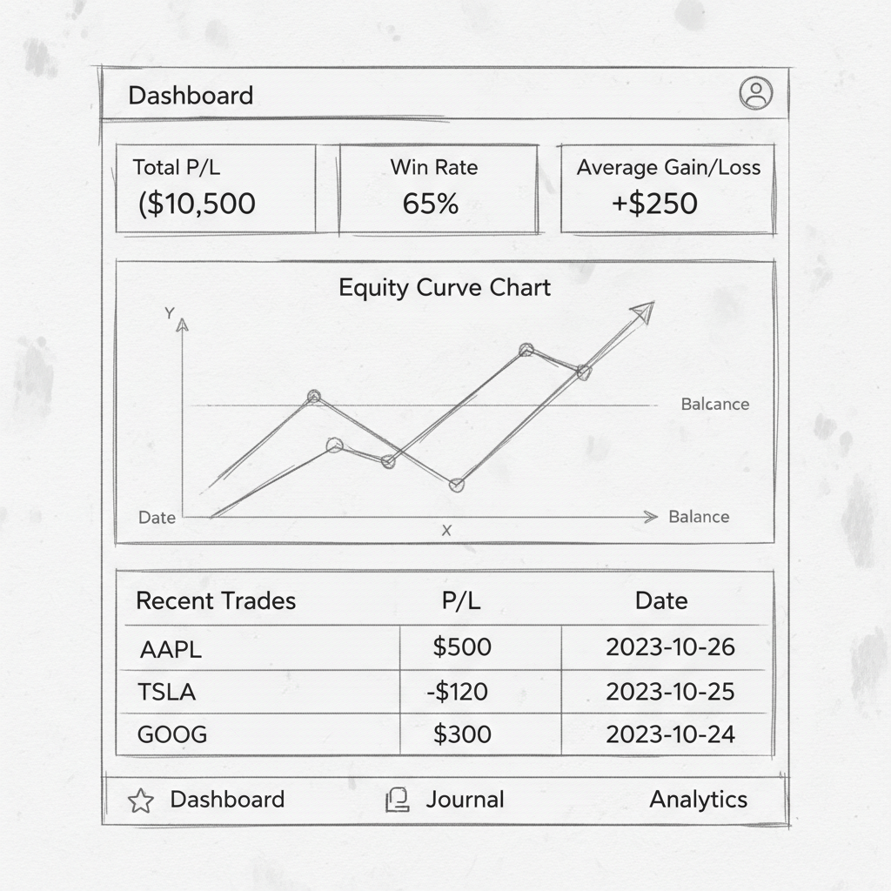
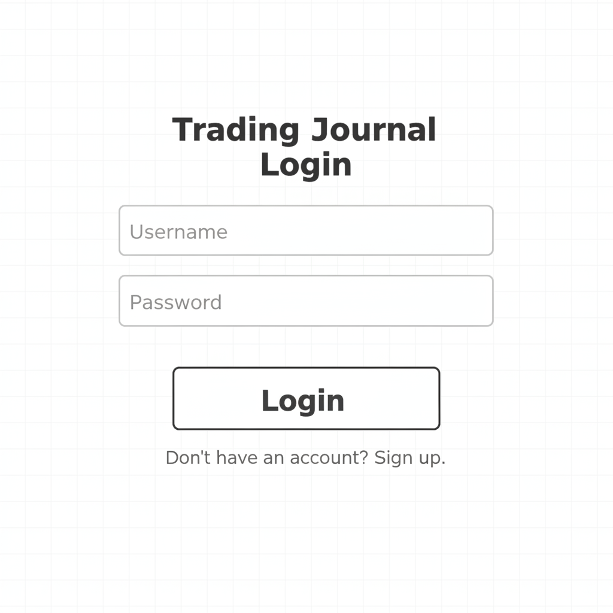
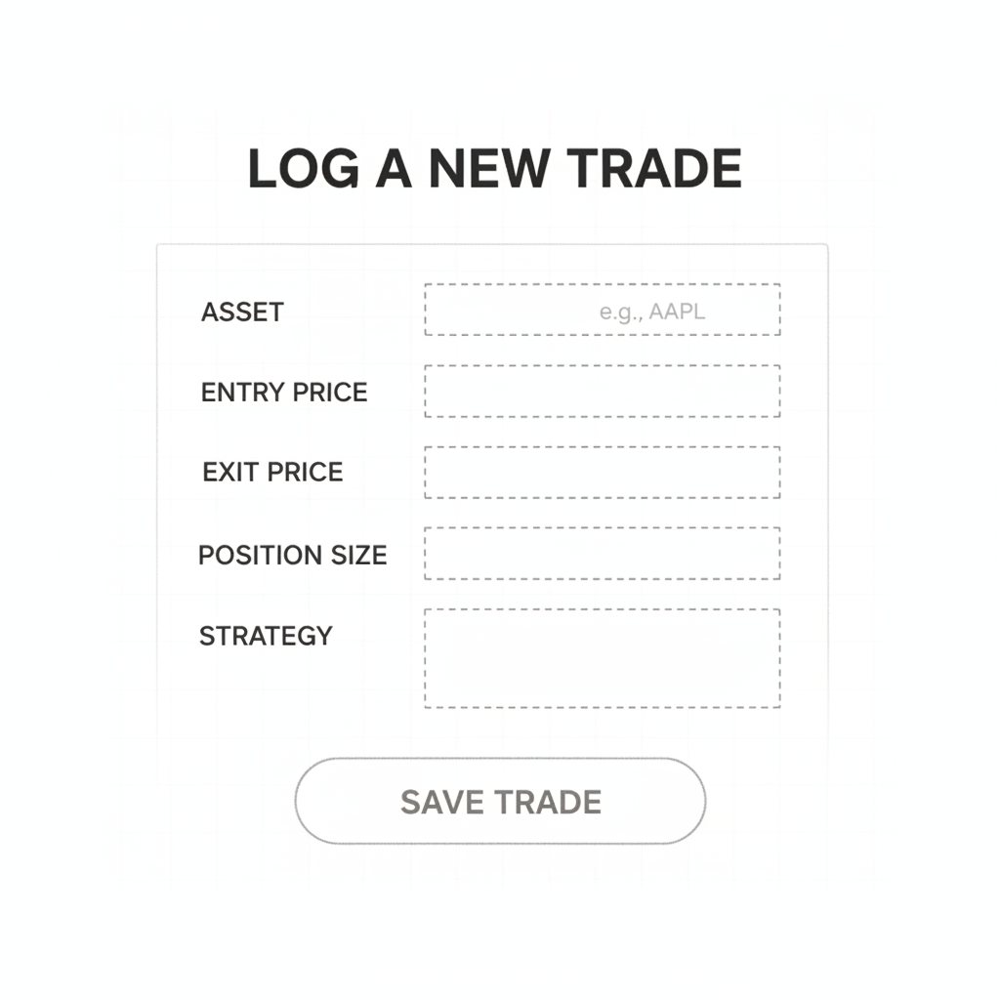

# CourtVision Analytics

A predictive analytics platform for NBA fans that uses historical data to forecast game outcomes, visualized through interactive dashboards and accessible via a secure user portal.

## Live Demo

**Deployed URL**: [To be updated after PythonAnywhere deployment]

## Test Credentials

### Internal Tester (Instructor)
- **Username**: `mohitg2`
- **Password**: `graingerlibrary`

### Internal Guest
- **Username**: `infoadmins`
- **Password**: `uiucinfo`

---

## Table 1: Foundational Topics Implemented (15 pts)

| # | Topic | Status |
|---|-------|--------|
| 1 | GitHub Repository, Environment Setup & Project Structure | ✅ |
| 2 | Wizard of Oz Prototyping / UI/UX Planning | ✅ |
| 3 | Models + ORM Basics | ✅ |
| 4 | Views + Templates + URLs | ✅ |
| 5 | User Authentication for Internal Users | ✅ |
| 6 | Deployment (Production Setup) | ✅ |

---

## Table 2: Functional Add-ons Implemented (24 pts = 15 + 9 bonus)

| # | Topic | Status | Description |
|---|-------|--------|-------------|
| 1 | ORM Queries + Data Summaries | ✅ | Aggregations for leaderboards, team stats, prediction accuracy |
| 2 | Static Files (CSS/JS Integration) | ✅ | Bootstrap 5, custom CSS styling |
| 3 | Charts / Visualization (Matplotlib) | ✅ | Team comparison bar charts embedded as base64 |
| 4 | Forms + Basic Input / CRUD | ✅ | User prediction forms, export options |
| 6 | Integrate External APIs | ✅ | NBA API (balldontlie.io) integration |
| 7 | Data Presentation & Export | ✅ | CSV and JSON export functionality |
| 8 | User Authentication for External Users | ✅ | Public signup with auto-login |
| 9 | External Databases Integration | ✅ | PostgreSQL configuration for production |

**Total: 8 add-on topics (5 required + 3 bonus)**

---

## Screenshots

### Home Page


### Login Page


### Core Features


---

## Quick Start

### 1. Clone and Setup Environment
```bash
git clone https://github.com/justinw2274/Final_Project_justin_jjward2.git
cd Final_Project_justin_jjward2
python -m venv venv
source venv/bin/activate  # On Windows: venv\Scripts\activate
pip install -r requirements.txt
```

### 2. Run Migrations
```bash
python manage.py migrate
```

### 3. Load Sample Data & Create Accounts
```bash
python manage.py load_sample_data
python manage.py create_instructor
python manage.py create_guest
```

### 4. Run Development Server
```bash
python manage.py runserver
```

Visit http://127.0.0.1:8000/

---

## Project Structure

```
final_project/
├── courtvision/           # Django project settings
│   └── settings/
│       ├── base.py        # Shared settings
│       ├── development.py # Development settings (SQLite)
│       └── production.py  # Production settings (PostgreSQL)
├── core/                  # Main application
│   ├── models.py          # Team, Game, Player, UserPick, UserProfile
│   ├── views.py           # All view functions and CBVs
│   ├── forms.py           # UserPickForm, ExportForm
│   ├── admin.py           # Admin panel configuration
│   ├── services/          # NBA API integration
│   ├── templatetags/      # Custom template filters
│   └── management/        # Custom management commands
├── accounts/              # Authentication app
│   ├── views.py           # Login, Logout, Signup
│   └── forms.py           # Custom auth forms
├── templates/             # HTML templates
├── static/                # CSS, JS, images
├── docs/                  # Documentation
│   ├── project_summary.md # Full project summary
│   └── final.txt          # Reflection notes
├── wireframes/            # UI/UX wireframes
│   └── v1/                # Version 1 prototypes
├── manage.py
└── requirements.txt
```

---

## Documentation

All documentation is located in the `/docs/` folder:
- **project_summary.md** - Complete summary of all topics implemented
- **final.txt** - Reflection on lessons learned and challenges

Wireframes are located in `/wireframes/v1/`:
- dashboard.png
- login.png
- core_feature.png
- error_state.png

---

## Features

### User Experience Flow
1. **Landing Page** → View featured game, upcoming games, standings
2. **Sign Up / Login** → Create account or authenticate
3. **Dashboard** → View today's games with predictions
4. **Game Detail** → See prediction, chart, make your pick
5. **Teams** → Browse all teams, view rosters and stats
6. **Analytics** → Leaderboards, model accuracy, top predictors
7. **Export** → Download prediction data as CSV/JSON

### Key Features
- **Game Predictions**: ML-simulated predictions with confidence scores
- **Community Picks**: Vote on game outcomes, see community consensus
- **Team Comparison Charts**: Matplotlib-generated visualizations
- **Leaderboards**: Track top predictors and model accuracy
- **Data Export**: Download predictions in CSV or JSON format

---

## Technologies

- **Backend**: Django 4.2+
- **Frontend**: Bootstrap 5, HTML5, CSS3
- **Database**: SQLite (dev) / PostgreSQL (prod)
- **Visualization**: Matplotlib
- **Deployment**: PythonAnywhere

---

## Management Commands

```bash
# Load sample NBA data (30 teams, players, games)
python manage.py load_sample_data

# Create instructor account (mohitg2/graingerlibrary)
python manage.py create_instructor

# Create guest account (infoadmins/uiucinfo)
python manage.py create_guest

# Sync from NBA API (optional)
python manage.py sync_nba_data --api-key YOUR_KEY
```

---

## Deployment

### PythonAnywhere Setup
1. Upload project files
2. Create virtual environment: `mkvirtualenv --python=/usr/bin/python3.10 courtvision`
3. Install dependencies: `pip install -r requirements.txt`
4. Set WSGI configuration to use `courtvision.settings.production`
5. Configure static files: `/static/` → `/home/username/final_project/staticfiles`
6. Run: `python manage.py collectstatic`
7. Run migrations and load data
8. Reload web app

---

*INFO 390 Final Project - University of Illinois*
